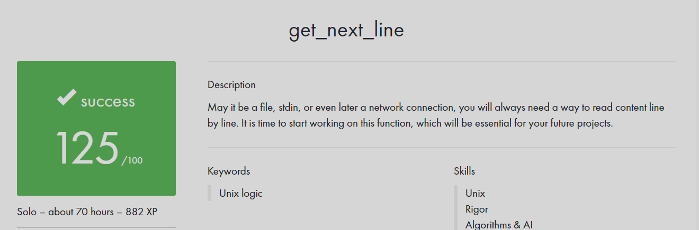

# get_next_line

## Introduction

Welcome to the `get_next_line` project, an essential exercise designed to deepen your understanding of file manipulation, memory management, and the intricate processes involved in reading data from files within an operating system. This project challenges you to implement a highly practical function capable of extracting individual lines from a file descriptor.

## Description



The primary goal of this project is to cultivate your expertise in the intricacies of file operations, illuminating the nuances of opening, reading, and closing files in an OS environment. You will gain insights into how files are interpreted by programming languages for analysis, a foundational skill for developers frequently engaged in data management and persistence tasks.

Achievement:

get_next_line: Success
Score: 125
Time Spent: Solo – about 70 hours – 882 XP

Keywords: Unix logic

Skills: Unix, Rigor, Algorithms & AI

## Guidelines and Resources

- [Subject Guidelines](gnl.en.subject.pdf): This PDF document comprises essential guidelines and instructions for the get_next_line project within Libft. It offers comprehensive insights into the project's prerequisites and anticipated outcomes. To gain a thorough comprehension of the project's objectives and specifications, kindly consult this document. Your reference to this resource will prove invaluable in navigating the goals and particulars of the get_next_line project.

## Features

- A function that reads and returns a line from a file descriptor.
- The capability to efficiently process data from multiple file descriptors simultaneously (bonus).

## Folder Structure

The structure of the project repository has been meticulously organized as outlined below:

- **gnl_125_submitted**: This folder contains the main project submission.
  - `get_next_line.c`: This file hosts the primary implementation of the `get_next_line` function.
  - `get_next_line_utils.c`: Here, you'll find utility functions indispensable for the main implementation.
  - `get_next_line.h`: This header file houses function prototypes and essential includes for the project.

- **.gitignore**: Excludes specified files and directories from version control, like the temporary test environment.
- **README.md**: The project's main documentation file.
- **get_next_line.c**: A version of the `get_next_line` implementation with updates.
- **get_next_line.h**: An updated header file for the `get_next_line` function.
- **get_next_line_bonus.c**: An updated version of the `get_next_line` implementation, including bonus features.
- **get_next_line_bonus.h**: Header file for the bonus features of the `get_next_line` function.
- **get_next_line_en.subject.pdf**: A PDF document outlining the project subject and requirements.
- **get_next_line_utils.c**: Utility functions file with updated variable and function names.
- **get_next_line_utils_bonus.c**: An updated version of utility functions for bonus features.
- **gnl.en.subject.pdf**: Renamed PDF document detailing the project's subject.
- **results.png**: An uploaded image file capturing project results.

## Usage

### Incorporating the Function

To integrate the `get_next_line` function into your code, include its header:

```c
#include "get_next_line.h"
```

When compiling your code, ensure you include the source files and set the appropriate buffer size:

```sh
gcc -Wall -Werror -Wextra -D BUFFER_SIZE=<size> get_next_line.c get_next_line_utils.c
```

## Testing

To assess the functionality of the `get_next_line` function, edit the `get_next_line.c` file and add a main function and headers. Modify the `test.txt` file for varying test cases. Execute the following command (replace "xx" with your desired buffer size):

```sh
gcc -Wall -Werror -Wextra -D BUFFER_SIZE=xx get_next_line.c get_next_line_utils.c && ./a.out
```

Alternatively, employ the [Tripouille/gnlTester](https://github.com/Tripouille/gnlTester) tool for comprehensive testing.

## Contributing

Contributions are welcome! If you find any issues or improvements, please feel free to open an issue or create a pull request.

## License

This project is released under the [MIT License](LICENSE), granting you the freedom to use, modify, and distribute the code according to the terms outlined.

## Acknowledgements

We would like to express our gratitude to the developers and contributors of related tools and libraries that have made this project possible.
